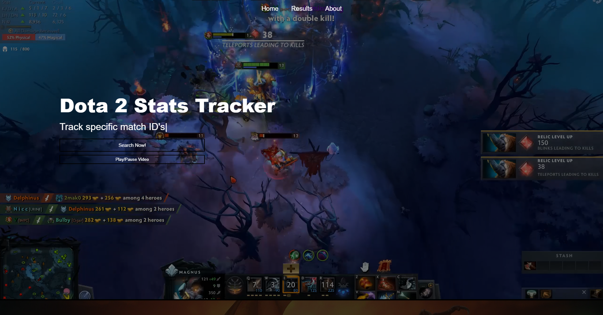
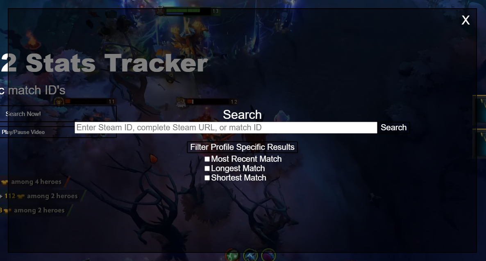
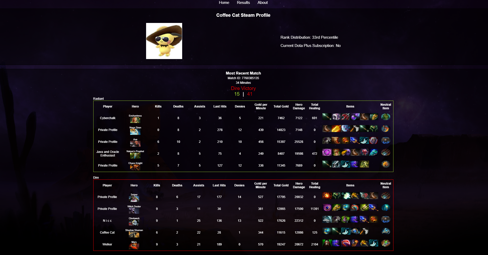
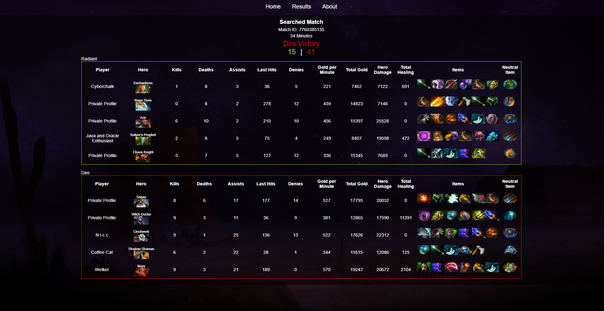

# Dota API Tracker 2

[Live Deploy Link](https://dota-api-website-2.netlify.app/)

## Description

This project is my second attempt at a dynamic Dota 2 API tracker website, designed to provide comprehensive game statistics for players of the popular Steam game, Dota 2. Utilizing the OpenDota API, users can access detailed match histories, performance metrics, and player profiles, all within a seamless and intuitive interface.

## Table of Contents

- [Installation](#installation)
- [Usage](#usage)
- [Features](#features)
- [Badges](#badges)
- [Questions](#questions)

## Installation

```
1. Clone the repository from GitHub using the command `git clone dota-api-website-2` in GitBash.

2. Navigate to the project directory: `cd dota-api-website-2`.

3. Type `code .` to open the project inside of Visual Studio Code.

4. Use the command `npm run develop` to start the application in the default browser.
```

## Usage

1. Click the `Search Now!` button on the homepage to pull up a search bar.
2. Enter a Steam ID, complete Steam URL, or match ID.
3. The `Filter Profile Specific Results` button will pull up options to search for profile specific stats.
4. Click the `Search` button to be redirected to a page showing search results.

### Home Page



### Search Menu



### Specific Profile Search Result



### Specific Match Search Result



### About Page


## Features

**Open Dota API**

- Integrates public match, profile, hero, and item data from the Open Dota API for the most up to date information.

**Express.js**

- Server-side Routing: Used Express.js to define routes for handling HTTP requests and responses.
- Middleware Integration: Integrated Express middleware for tasks such as request parsing, authentication, and error handling.

**Node.js**

- Server Environment: Utilized Node.js to create a robust server environment capable of handling concurrent requests.
- Asynchronous Programming: Leveraged Node.js's event-driven architecture for efficient handling of I/O operations.

**React**

- Dynamic User Interface: Built interactive and dynamic user interfaces with React for seamless user experiences.
- Component-based Architecture: Developed reusable UI components to encapsulate behavior and facilitate code maintenance.

**JavaScript**

- Core Language: Leveraged JavaScript for client-side and server-side development to create cohesive web applications.
- ES6+ Features: Utilized modern JavaScript features such as arrow functions, destructuring, and async/await for cleaner and more concise code.

**Vite**

- Development Server: Used Vite for fast and efficient development with features like hot module replacement and optimized build times.
- Modern Build Tooling: Leveraged Vite's support for modern JavaScript features, CSS preprocessing, and dependency resolution.

**Express Middleware**

- Custom Middleware: Implemented custom middleware functions in Express for tasks such as authentication, logging, and request processing.
- Error Handling: Used middleware for centralized error handling to improve application robustness and maintainability.

**React Router DOM**

- Client-side Routing: Implement client-side routing with React Router DOM for navigation and managing application state based on URL changes.
- Route Configuration: Define route configuration to map URLs to React components and enable navigation between different views.

## Badges


## Questions

You are welcome to contact me with questions using the following:

- [GitHub Profile](https://github.com/bwing2)

- [Email](mailto:brandon.wing245@gmail.com)
